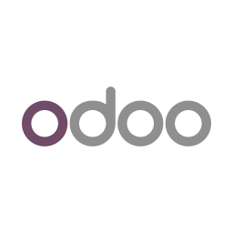
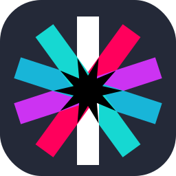
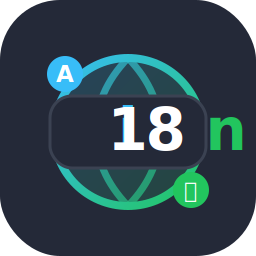
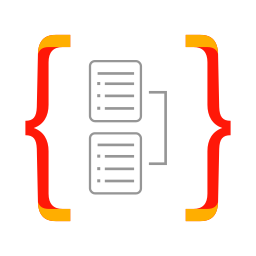
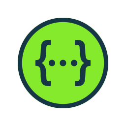

<!-- markdownlint-disable MD041 -->

## 👋 ¿Quién soy?

Soy **David Torró**, desarrollador de software centrado en crear proyectos reales, útiles y bien estructurados.

Me gusta construir cosas que no se queden solo en la teoría: aplicaciones web, APIs, bots, automatizaciones, servicios propios e infraestructura. 

Aprendo haciendo, pero intentando hacerlo con cabeza: código limpio, arquitectura clara y proyectos que pueda mantener y evolucionar con facilidad.

Mi enfoque está bastante claro: **crear software que funcione, se entienda y pueda crecer**.

---

## 🚀 En qué estoy enfocado ahora

- 🧩 **Desarrollo web y full-stack**
- ⚙️ **Backends y APIs robustas**
- 🤖 **Bots, automatización y herramientas propias**
- 🧠 **IA local aplicada a proyectos para experimentar**
- 🛰️ **Homelab para servicios propios, despliegues e infraestructura**
- 🧼 **Código limpio, ordenado, mantenible y sobre todo escalable**

---

## 🛠️ Stack y herramientas

<!-- markdownlint-disable MD033 MD045 MD009 -->

  
Lenguajes de Programación

  

  
Desarrollo Backend

  

  
Desarrollo Frontend

  

  
Desarrollo Móvil/Multiplataforma

  

  
Bases de Datos y ORMs

  

  
Testing

  

  
Documentación

  

  
Infraestructura y DevOps

  

  
Nube

  

  
Herramientas

   

  
Sistemas

  

---

## 🖥️ Algunos de mis proyectos

### 📝 Note Nav Cards — Plugin para Obsidian

Plugin de Obsidian para crear tarjetas de navegación entre notas usando bloques de código simples y configurables.

  
  

🔗 **Repositorio:** [Ver proyecto](https://github.com/DavidTorro/Obsidian-Note-Nav-Cards-Plugin)

---

### 🌐 LinkedFlow — Automatización para LinkedIn

Herramienta enfocada en automatización y generación de comentarios para publicaciones de LinkedIn.

  
  
  
  
  

🔗 **Repositorio:** [Ver proyecto](https://github.com/DavidTorro/LINKEDFLOW)

---

### 🛰️ Homelab personal

Infraestructura propia para aprender despliegues, bases de datos, servicios internos, túneles seguros, automatización y entornos reales.

  
  
  

---

## 🤔 Mentalidad

Estoy en una etapa de aprendizaje constante, pero con una idea muy clara: quiero aprender construyendo cosas reales.

No busco llenar GitHub de repos vacíos ni hacer proyectos sin fondo. Prefiero crear herramientas, romper cosas, arreglarlas, entenderlas y mejorar la siguiente versión.

---

## 📬 Contacto

Puedes contactarme a través de correo electrónico, LinkedIn o Instagram. 

Siempre estoy abierto a nuevas oportunidades, colaboraciones y proyectos interesantes.

<!-- markdownlint-disable MD033 MD045 MD047 MD009 -->

 

  
  &nbsp;&nbsp;&nbsp;&nbsp;&nbsp;&nbsp;&nbsp;&nbsp;&nbsp;&nbsp;&nbsp;&nbsp;&nbsp;&nbsp;&nbsp;
  
  &nbsp;&nbsp;&nbsp;&nbsp;&nbsp;&nbsp;&nbsp;&nbsp;&nbsp;&nbsp;&nbsp;&nbsp;&nbsp;&nbsp;&nbsp;
  

